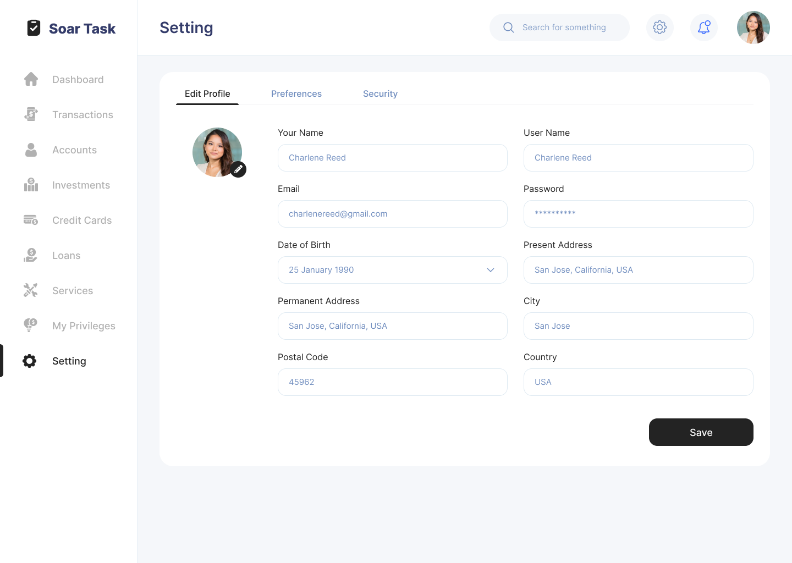
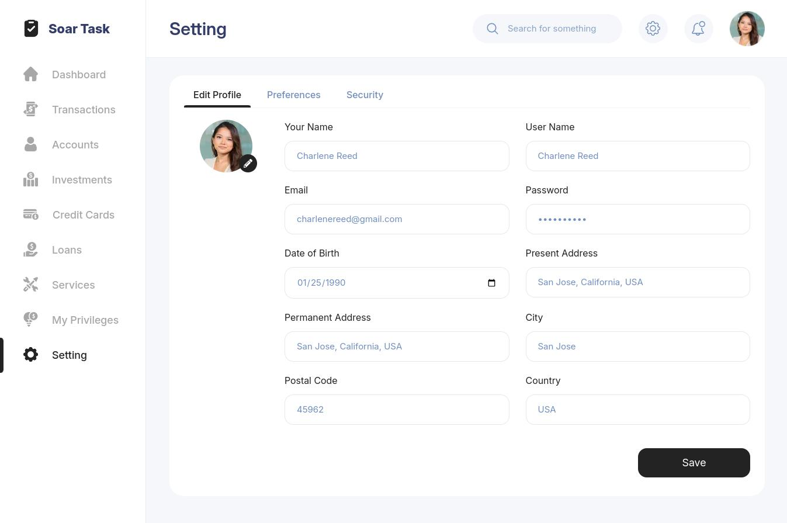
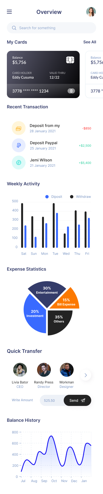
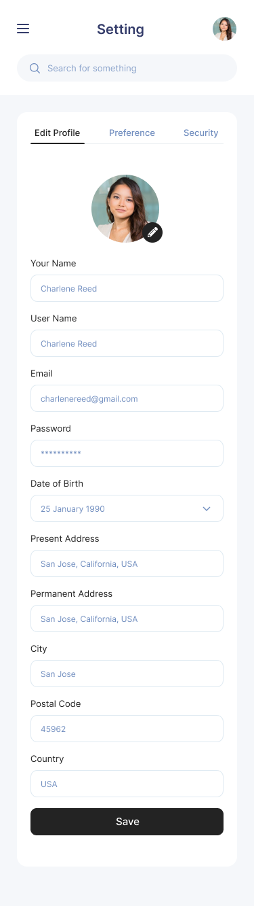
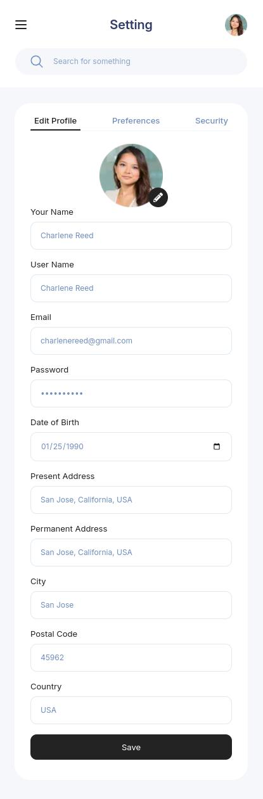

# Soar

Soar dashboard and settings pages

## Screenshots

#### Dashboard

<table>
  <tr>
    <th>Expected</th>
    <th>Reality</th>
  </tr>
  <tr>
    <td></td>
    <td></td>
  </tr>
</table>

#### Setting

<table>
  <tr>
    <th>Expected</th>
    <th>Reality</th>
  </tr>
  <tr>
    <td></td>
    <td></td>
  </tr>
</table>

#### Dashboard mobile

<table>
  <tr>
    <th>Expected</th>
    <th>Reality</th>
  </tr>
  <tr>
    <td></td>
    <td></td>
  </tr>
</table>

#### Setting mobile

<table>
  <tr>
    <th>Expected</th>
    <th>Reality</th>
  </tr>
  <tr>
    <td></td>
    <td></td>
  </tr>
</table>

## Figma URL:

https://www.figma.com/design/Lf57jfEvFsQjNZdQi07qyv/Soar-Front-End-Dev-Task?node-id=0-1&node-type=canvas&t=ARR1PCUzrKTgshvn-0

## Getting Started

Install required dependencies:

```bash
yarn
```

Run the development server:

```bash
yarn dev
```

Open [http://localhost:3000](http://localhost:3000) with your browser to see the result.

## QA & Decision clarifications

I'm OCD about design. I like paying attention to details. So I created some custom properties in TailwindCSS config file (tailwind.config.ts) because in Figma some parts of the app are oddly designed. Paddings, gaps, font sizes, line heights, border-radiuses, etc. seem inconsistent.
For example:

1. In many places we have unusual paddings and gaps (7px, 11px, 15px, 17px, 16.11px, 23px, 31px, 41px, etc.) between elements. Left padding of the header is 25px and right padding is 26px. Text inputs have 13px padding from top and 12px padding from bottom. I've worked with many professional designers from US, UK, Canada, etc. We've built many component libraries and design systems in Figma. Even a small component needs to be meticulously examined. I've never seen above values being used as paddings, spacings, font sizes, etc. TailwindCSS already has good predefined list of values for paddings, margin, font sizes, line heights, etc. So in some places I used values from Tailwind but whenever I couldn't get the exact look, I created custom properties and just copy-pasted those exact values from Figma.

2. We have too many similar looking colors. Not sure if it was intentional. For example, icons have this #718EBF color and search box's text has #8BA3CB color. In header we have bottom border (#E6EFF5) for big screens but we don't have it at all for small screens. Not sure why.

3. In Dashboard`s "Quick Transfer" section, "Livia Bator" is highlighted. Does it mean this is selected? If it does, it's not so intuitive. Also, what happens when I click the > (right arrow) button? If it really scrolls to the right, where are we going to show the < (left arrow) button?

4. In "Expense Statistics" sections, why blue 20% takes more space than 30% and 35%? Or does it mean that "it's not important and I should just ignore it"?

5. Why in Setting page, on mobile version, text inputs have 10px border radius but black "Save" button has 9px border radius? Is this intentional?

6. Why the "Settings page" is called "Setting" and the word "Deposit" is written "Diposit" in weekly activity?

I'm not sure if I had to ignore those bad design decisions and fix them myself or just copy-paste values from Figma as they are. So I did both.
